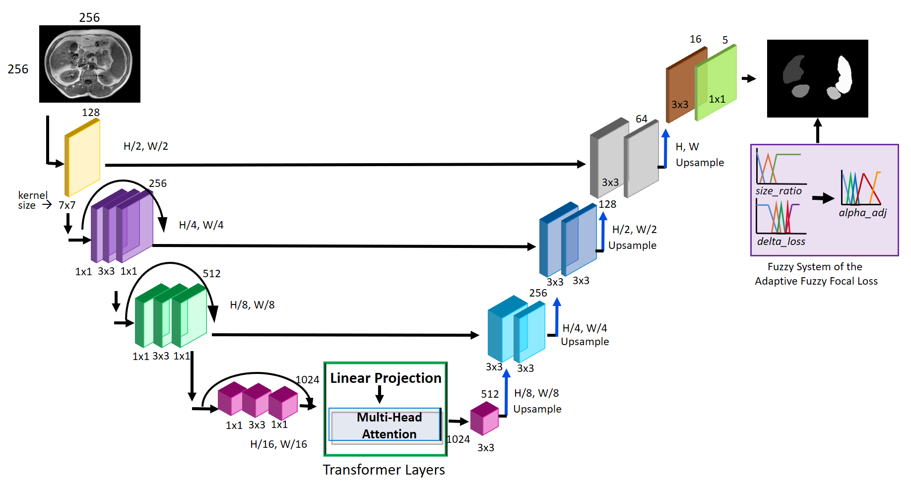
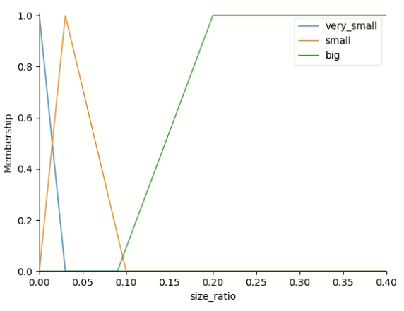
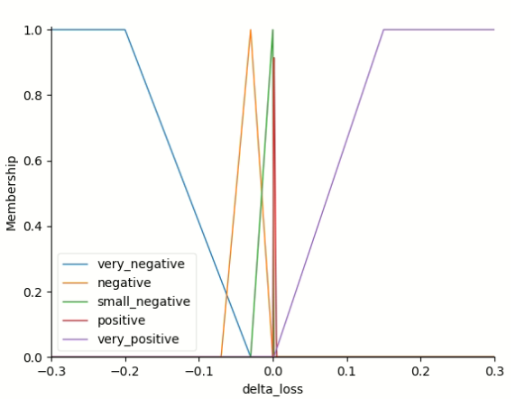
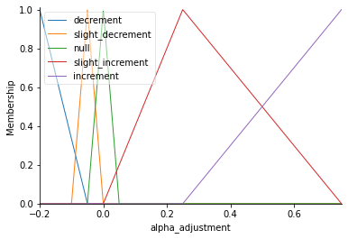

# AFFL-TransUNet
This is a repository for the code used in "A TransUNet model with an adaptive fuzzy focal loss for medical image segmentation."
# Source
This paper is currently under review 

# Description of the repository
This repository contains the code for the fuzzy inference system to automatically adjust the alpha term of the focal loss function 

# Block diagram of our proposal, AFFL-TransUNet

# Inputs and outputs of the fuzzy system
 
 
 
